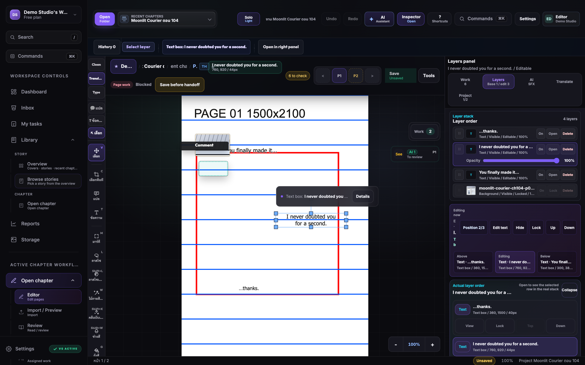
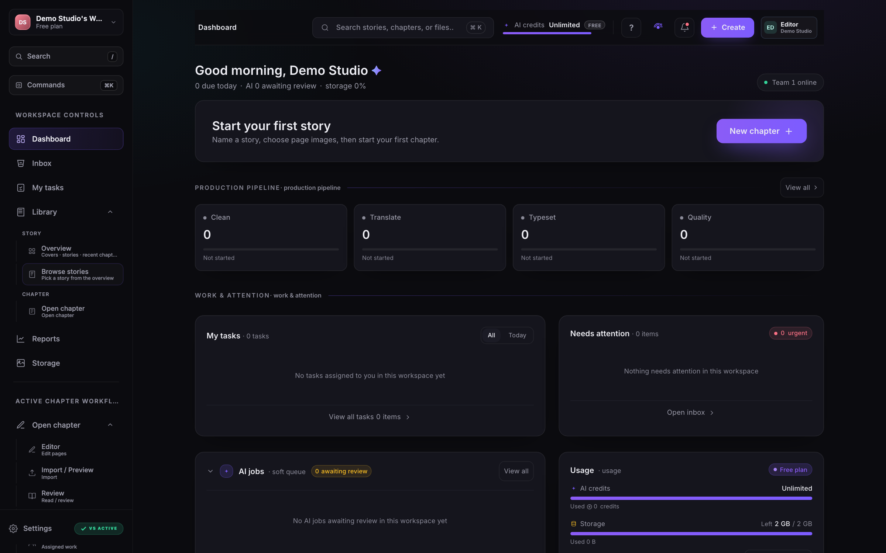
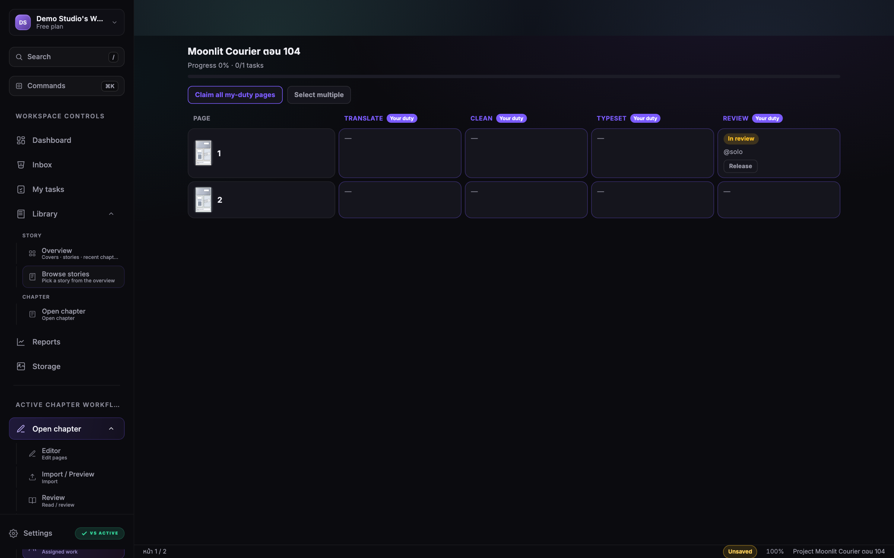
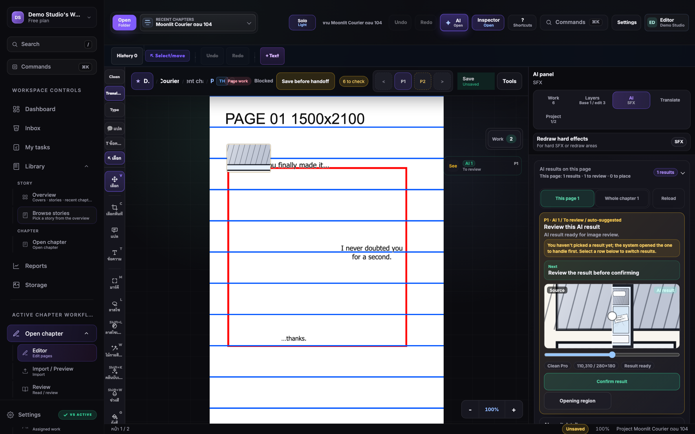

# Manga Translation Studio

A full, browser-based **scanlation / comic-localization studio** — the kind of tool a fan-translation team uses to take a raw manga page and ship a clean, typeset, translated version of it. Upload pages, **clean** the original text off the artwork, **translate** the dialogue, **typeset** it back onto the page, run it through **QC/review**, and **export** the finished result — with a real team workflow on top: roles, duties, a per-page work board, live presence, and handoffs between cleaner → translator → typesetter → reviewer.

> **Read this first.** This is a large system I built **entirely on my own**, over many months, learning a lot of it as I went. It works — but it is **nowhere near polished and it has plenty of bugs**. I'm open-sourcing it **as-is** so anyone who wants a free, self-hostable scanlation tool — or just wants to read / learn from / build on a big real-world SvelteKit + Bun codebase — can take it and run. **It is not actively maintained.** Fork it, fix it, ship it. See [Project status & honesty](#-project-status--honesty).

**License:** [MIT](#-license) — use it, modify it, self-host it, build a product on it. No warranty; as-is.

---

## 📸 Screenshots

<table>
  <tr>
    <td width="50%"><b>The editor</b><br><sub>clean, typeset & place text on a Fabric.js canvas</sub><br></td>
    <td width="50%"><b>The dashboard</b><br><sub>your studio's pipeline at a glance</sub><br></td>
  </tr>
  <tr>
    <td width="50%"><b>The work board</b><br><sub>every page, every duty, every handoff</sub><br></td>
    <td width="50%"><b>AI-assisted clean</b><br><sub>review the result with a before / after compare</sub><br></td>
  </tr>
</table>

---

## Table of contents

- [Screenshots](#-screenshots)

- [What it is](#-what-it-is)
- [The scanlation pipeline](#-the-scanlation-pipeline)
- [Feature tour](#-feature-tour)
- [Architecture](#-architecture)
- [The editor engine](#-the-editor-engine)
- [Data model](#-data-model)
- [Tech stack](#-tech-stack)
- [Repository layout](#-repository-layout)
- [By the numbers](#-by-the-numbers)
- [Self-hosting / running locally](#-self-hosting--running-locally)
- [Project status & honesty](#-project-status--honesty)
- [The story: built solo](#-the-story-built-solo)
- [License](#-license)
- [Hire me / contact](#-hire-me--contact)

---

## 🎯 What it is

Localizing a manga/comic page is a multi-step craft. A page arrives as a flat image with the original (usually Japanese) text baked into speech bubbles and onto the art. To translate it you have to:

1. **Clean** — erase the original text and rebuild the artwork underneath (inpainting, bubble-fill, screentone-matching).
2. **Translate** — write the target-language script for each bubble and SFX.
3. **Typeset** — place the translated text back onto the page with the right font, size, spacing, and position so it reads naturally inside each bubble.
4. **QC / review** — a reviewer marks issues, requests changes, and approves.
5. **Export** — render the finished page back out to an image.

**Manga Translation Studio** does all of this in the browser, on a Fabric.js canvas, with an AI-assisted clean step, a translation workspace, a real typesetting engine, and a multi-tenant team platform wrapped around it. Work is organized as **Story → Chapter → per-language Pages**, and a team can split it by duty (cleaner / translator / typesetter / QC) and hand pages down the pipeline.

---

## 🔧 The scanlation pipeline

```
        STORY  ─▶  CHAPTER  ─▶  PAGE (per target language)
                                  │
                                  ▼
   ┌─────────┐   ┌──────────┐   ┌──────────┐   ┌──────────┐   ┌────────┐
   │  CLEAN  │──▶│ TRANSLATE│──▶│ TYPESET  │──▶│  QC /    │──▶│ EXPORT │
   │ (erase, │   │ (script  │   │ (place   │   │  REVIEW  │   │ (render│
   │  inpaint│   │  per     │   │  text on │   │ (marks,  │   │  PNG)  │
   │  bubbles)│  │  bubble) │   │  page)   │   │  approve)│   │        │
   └─────────┘   └──────────┘   └──────────┘   └──────────┘   └────────┘
        ▲              ▲              ▲              ▲
     cleaner       translator     typesetter    reviewer / QC
              (handoffs between duties, tracked per page on a work board)
```

Each page carries its own state through the pipeline. A **work board** renders every page as a row with a column per duty (Translate / Clean / Typeset / Review), so a lead sees progress at a glance and workers can claim, do, and hand off their pages. A **version-review** system tracks revision requests and decisions across the lifecycle.

---

## ✨ Feature tour

### The editor — where 3 of the 4 stages happen
- **Fabric.js v6 canvas** with pan/zoom (wheel, pinch, keyboard `Ctrl +/-/0`), fit-to-screen reset, and a zoom indicator.
- **Cleaning toolset** (~25 canvas tools): bubble-clean, a tunable **PRO-clean** engine (flat / gradient / screentone strategies), healing brush, clone stamp, magic-wand & magic-select, lasso & polygon-lasso, marquee, color-range select, refine-edge, bucket fill, screentone fill, adjustments.
- **Real computer-vision under the hood:** OpenCV (WASM), morphology, mask buffers, and an **inpainting Web Worker** so heavy raster ops don't block the UI.
- **AI clean / inpaint:** send a region to an AI backend, review the result with a before/after compare slider, and confirm or reject it.
- **Typesetting:** positionable, in-place-editable text boxes; font, size, **letter-spacing**, line layout, alignment, fill + stroke; a **colour eyedropper** to sample straight from the artwork; reusable text-style presets; fit-text-to-box; Thai-aware line wrapping.
- **Layers:** text, image, and image-edit (clean) layers — each with visibility / lock / opacity / reorder, plus a unified layer stack and inspector.
- **History:** full undo/redo with command coalescing (a burst of arrow-key nudges collapses into one undo entry).
- **Keyboard-first:** arrow-key nudging (1px / Shift = 10px), `Ctrl+S` to flush a save, a `?` shortcuts sheet, and per-duty "Easy Mode" tool recipes that arm the right tools for the job.

### Translation & review
- Per-page translation script: pin a bubble on the image, type its translation (multi-line), and hand off to the typesetter.
- **Translation memory** and a **glossary** to keep terminology consistent.
- A dedicated **review canvas** with annotation marks, comments, and approve / request-changes decisions linked back to the page.

### Team & real-time collaboration
- **Workspaces** with access roles (owner / admin / editor / viewer) and **studio duties** (translator / cleaner / typesetter / QC / team-lead / guest).
- **Solo vs Team** modes that reshape how much workflow machinery is shown.
- **Per-page work board**, duty-scoped task assignment, claim / send-forward / release, and a duty inbox.
- **Live presence & edit-leases:** concurrent-edit steering so two people don't silently clobber the same page, with compare-and-swap on save as the final net; a realtime bus pushes updates over a streaming channel.
- **Notifications** with a polished toast system (auto-dismiss countdown bar, hover-to-pause, per-type colours, fly/flip stacking animation).

### Platform & back-office
- **Auth:** email + password, an **email-OTP verification wall**, JWT access/refresh sessions, OAuth/SSO (via `arctic`), Cloudflare Turnstile, CSRF protection, and layered **Redis-backed rate-limiting**.
- **Billing:** plans, a **credit / usage ledger**, coupons, chargebacks/refunds, reconciliation, and **Dodo Payments** integration (with signed webhooks). Cost estimation per AI job.
- **Multi-provider AI:** a provider router across OpenRouter / OpenAI / ChatGPT image backends, with **bring-your-own-API-key (BYO)** support and per-workspace provider controls.
- **Storage:** S3-compatible object storage (MinIO) with **copy-on-write** assets, versioning, per-workspace **quotas**, and **egress accounting / guards**.
- **Safety & compliance:** content moderation, CSAM blocking, GDPR tooling, and an audit trail (admin audit, impersonation events, upload audit, consent events).
- **Support desk:** ticketing with messages and decisions.
- **i18n:** four shipped languages — Thai, English, Indonesian, Malay — with a hardcoded-string guard test to keep coverage honest.
- **Observability:** Prometheus metrics, Grafana dashboards, cAdvisor, and Alertmanager wired into the Docker stack.
- **Background worker:** AI jobs, exports, GC, and cron tasks run out-of-band.

---

## 🏗 Architecture

```
┌────────────────────────────────────────────────────────────────────┐
│  Browser — SvelteKit 2 + Svelte 5 (runes)                            │
│   • MangaEditor (Fabric.js engine, ~8.8k LOC)                        │
│   • ~30 runes stores (editor, project ~10k LOC, auth, realtime…)     │
│   • work board · review canvas · panels · admin · dashboard          │
│   • realtime/presence client · i18n (th/en/id/ms) · toasts           │
└───────────────┬──────────────────────────────────────┬─────────────┘
                │ REST  /api/*                           │ realtime stream
                ▼                                        ▼
┌────────────────────────────────────────────────────────────────────┐
│  Backend — Bun + Hono  (~36 route modules, ~100 services)            │
│   auth · projects/pages/layers · tasks/handoffs/work-states          │
│   AI router (multi-provider, BYO keys) · billing (Dodo, credits)     │
│   storage (CoW, quota, egress) · notifications · realtime · admin    │
│   moderation · GDPR · support · usage/metrics                        │
└───────┬───────────────┬───────────────┬───────────────┬─────────────┘
        ▼               ▼               ▼               ▼
  ┌──────────┐    ┌──────────┐    ┌──────────┐    ┌──────────────┐
  │ Postgres │    │  Redis   │    │  MinIO   │    │   Worker     │
  │ ~80      │    │ cache /  │    │ S3:      │    │ AI jobs ·    │
  │ tables   │    │ rate-    │    │ images,  │    │ exports ·    │
  │          │    │ limit /  │    │ assets,  │    │ GC · cron    │
  │          │    │ presence │    │ versions │    │              │
  └──────────┘    └──────────┘    └──────────┘    └──────────────┘
        └──────── Docker Compose + Caddy + Prometheus/Grafana ───────┘
```

- **Frontend** is a SvelteKit SPA. State lives in Svelte 5 **runes** stores (`$state` / `$derived` / `$effect`). The editor is a `MangaEditor` class wrapping a Fabric.js canvas; everything else is components + stores around it. One `WorkspaceShell` hosts the live editor and the workspace views.
- **Backend** is a Bun runtime serving a Hono router under `/api/*`, fronting Postgres (relational data), Redis (cache / rate-limit / presence / single-flight), and MinIO (image + asset blobs). A separate **worker** handles long jobs and cron.
- **Concurrency** is handled with Redis-backed edit-leases + work-locks and optimistic compare-and-swap on save; a realtime bus fans changes out to connected clients.
- **AI** goes through a provider-routing layer so a workspace can use the platform's keys or bring its own, with cost estimation and usage metering.
- Everything is containerized with Docker Compose (infra + observability); in development the frontend (Vite) and backend (Bun) run natively against the Dockerized infra.

---

## 🎨 The editor engine

The heart of the app is `frontend/src/lib/canvas/editor.ts` — an **~8,800-line `MangaEditor` class** wrapping Fabric.js. It owns the canvas, the text/image/edit layer model, selection, history (undoable commands), the viewport, and the dispatch into ~25 tools under `frontend/src/lib/editor/tools/`:

```
bubble-clean · pro-clean · healing-brush · clone-stamp · magic-wand · magic-select
lasso · polygon-lasso · marquee · color-range · refine-edge · bucket-fill
screentone-fill · adjustments · inpaint (+ inpaint Web Worker)
  …backed by: opencv-loader (WASM) · morphology · mask-buffer · raster · stroke-preview
```

The companion `frontend/src/lib/stores/project.svelte.ts` (**~10,000 lines**) is the project/document model and persistence brain — pages, layers, tasks, handoffs, save/conflict handling, and the pipeline state machine.

---

## 🗄 Data model

~80 Postgres tables, grouped roughly as:

- **Auth & identity:** `auth_users`, `auth_sessions`, `auth_external_identities`, `email_verification_tokens`, `password_resets`, `oauth_link_intent_tokens`, `auth_login_failures`
- **Workspaces & teams:** `workspaces`, `workspace_members`, `workspace_invites`, `workspace_contacts`, `workspace_api_keys`, `story_role_assignments`
- **Projects & pipeline:** `projects`, `project_pages`, `project_tasks`, `project_comments`, `project_versions`, `project_version_reviews`, `project_review_assignments`, `project_review_decisions`, `project_revision_requests`, `work_states`, `work_events`, `work_locks`, `work_state_transitions`
- **AI & jobs:** `ai_jobs`, `scheduled_jobs`, `export_jobs`, `export_presets`, `account_export_jobs`
- **Storage:** `assets`, `asset_records`, `asset_refs`, `asset_versions`, `content_blobs`, `storage_packs`, `user_storage_accounts`
- **Billing & usage:** `billing_plans`, `billing_addon_products`, `credit_ledger`, `credit_grants`, `credit_coupons`, `credit_allocations`, `payment_transactions`, `payment_reconciliations`, `chargeback_disputes`, `refund_events`, `dodo_webhook_events`, `workspace_billing_accounts`, `usage_events`, `byo_usage_events`
- **Language tooling:** `glossary_entries`, `tm_entries` (translation memory)
- **Safety, audit & support:** `csam_blocks`, `admin_audit`, `audit_events`, `impersonation_events`, `upload_audit_events`, `consent_events`, `moderation`, `support_tickets`, `support_ticket_messages`, `support_decisions`
- **Notifications:** `notifications`, `notification_preferences`

---

## 🧰 Tech stack

| Layer | Tech |
|---|---|
| **Frontend** | SvelteKit 2, Svelte 5 (runes), Vite 6, Fabric.js 6, OpenCV (WASM), image-js, magic-wand-tool, svelte-i18n, Sentry |
| **Backend** | Bun, Hono, PostgreSQL, Redis, MinIO (S3), sharp, zod, jsonwebtoken, bcryptjs, arctic (OAuth), Dodo Payments, Resend (email), croner (cron), prom-client |
| **Infra** | Docker Compose, Caddy, Prometheus, Grafana, cAdvisor, Alertmanager |
| **Testing** | Vitest (unit/component), Playwright (e2e) — 500+ test files |

---

## 📁 Repository layout

```
.
├── frontend/                 # SvelteKit app (~268k LOC, 259 Svelte components)
│   ├── src/lib/
│   │   ├── canvas/           # MangaEditor — the ~8.8k-line Fabric.js engine
│   │   ├── editor/ tools/    # ~25 canvas tools (clean, select, inpaint, CV)
│   │   ├── editor-ui/        # dock, options bar, panels
│   │   ├── components/       # work board, review, panels, admin, dashboard…
│   │   ├── stores/           # ~30 runes stores (project ~10k LOC, editor, auth…)
│   │   ├── collab/           # realtime presence / edit-lease client
│   │   ├── project/          # pipeline, export, page-export, presets
│   │   ├── api/              # typed API client
│   │   └── i18n/             # th / en / id / ms locales
│   └── e2e/                  # Playwright end-to-end specs
├── backend/                  # Bun + Hono API (~197k LOC)
│   └── src/
│       ├── routes/           # ~36 modules: auth, project, workspaces, ai, billing…
│       ├── services/         # ~100 services: ai-router, billing, storage, realtime…
│       ├── middleware/       # auth, rate-limit, csrf…
│       ├── migrations/       # ~80-table schema
│       └── prompt/           # AI prompt templates
├── docs/                     # design / architecture notes
├── observability/            # Prometheus / Grafana / Alertmanager configs
├── scripts/                  # ops scripts
└── docker-compose.yml        # local infra (postgres, redis, minio, observability)
```

---

## 📊 By the numbers

- **~465,000 lines** of TypeScript / Svelte (≈268k frontend + ≈197k backend)
- **259** Svelte components · **~30** runes stores · **36** backend route modules · **~100** backend services · **~80** Postgres tables
- **500+** test files (Vitest + Playwright)
- **3,400+** commits — all solo

---

## 🚀 Self-hosting / running locally

> This is a real multi-service app. Expect to spend time getting it up the first time, and expect rough edges. The steps below are the shape of it; adapt env vars and provider keys to your setup.

### Prerequisites
- [Docker](https://www.docker.com/) — Postgres, Redis, MinIO
- [Bun](https://bun.sh/) — backend runtime
- [Node.js](https://nodejs.org/) 20+ — frontend / Vite

### 1. Configure environment
```bash
cp .env.example .env
cp backend/.env.example backend/.env
```
Several features (AI clean/translate, email/OTP, billing, OAuth, Turnstile) need third-party provider keys — OpenRouter/OpenAI, Resend, Dodo Payments, an OAuth provider, Cloudflare Turnstile. The app runs without all of them; those specific features just won't work. **Never commit a real key.**

### 2. Start infrastructure
```bash
docker compose up -d postgres redis object-storage
```

### 3. Run migrations
```bash
cd backend && bun install && bun run migrate     # see backend/package.json for the exact script
```

### 4. Start the backend
```bash
cd backend && bun --watch src/index.ts            # → http://localhost:3001
```

### 5. Start the frontend
```bash
cd frontend && npm install && npm run dev          # → http://localhost:5173
```

Open **http://localhost:5173**. In local/dev mode the email-verification step can be satisfied without a real mailer (the OTP is minted server-side; see `backend/src/services/auth.service.ts`). For real email, configure a Resend key.

---

## 🩹 Project status & honesty

I'd rather be upfront than oversell this:

- **It has bugs — a lot of them.** It's a huge surface built by one person; there are rough flows, half-finished corners, and edge cases that break. Some are known; many aren't.
- **It is not actively maintained.** I'm stepping away to work on other things. I won't be triaging issues or reviewing PRs on a schedule. Treat this as a snapshot, not a living product.
- **No support / no warranty.** Provided strictly **as-is** (MIT). If you self-host it, you own it.
- **Fork freely.** The point of open-sourcing it is so someone can take it further. You don't need my permission for anything the license already grants.
- **Clean release.** This public repo ships with a **fresh git history** — no real credentials, user data, or private project assets. Bring your own provider keys.

If you build something cool on top of it, I'd love to hear about it — but you're under zero obligation.

---

## 📖 The story: built solo

I built this **entirely on my own** — the frontend, the backend, the ~8.8k-line editor engine, the computer-vision tooling, multi-provider AI, auth, billing, real-time collaboration, i18n, the team workflow, the infra, and the tests. It started as "I just want to clean and typeset a manga page in the browser" and kept growing into a real platform: a full pipeline, a multi-tenant team product, billing, safety, observability — the works.

I learned an enormous amount doing it: canvas/graphics programming, designing a reactive editor around a 10k-line document store, building a multi-tenant backend with ~100 services, concurrency and edit-conflict handling, payments, and shipping the whole thing under my own steam over **3,400+ commits**.

It's not perfect. But it's real, it's large, and it's mine — and now it's yours too.

---

## 📄 License

[MIT](LICENSE) © Suphot Prathumchat. Use it, copy it, modify it, self-host it, and build a commercial product on top of it. No warranty; provided as-is.

---

## 💼 Hire me / contact

I'm **looking for work** and open to **anything — full-time, part-time, contract, or small one-off gigs.** Frontend, backend, full-stack, tooling, canvas/graphics — whatever you've got. If a system this size, built solo, is the kind of thing you want on your team, let's talk.

📧 **suphotprathumchat@gmail.com**

If you found this useful, a ⭐ on the repo means a lot.
